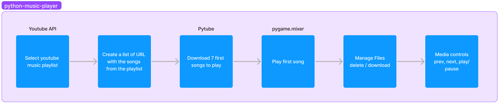
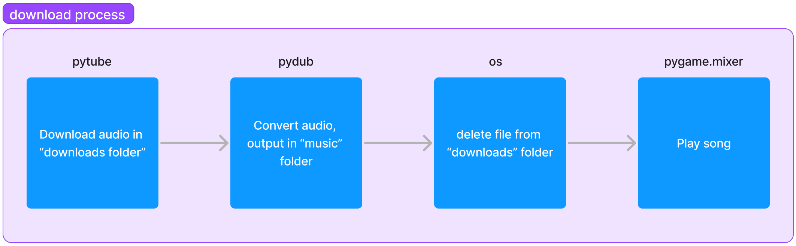

# Python youtube music player
This project is a terminal Python-based YouTube music player. You give it a playlist, and it plays the songs.

# How it works
With the [YouTube API](https://developers.google.com/youtube/v3/), it fetches the list of videos from your playlist and gets the URL of every video. Then, it will download some audio files with [Pytube](https://pytube.io/en/latest/) and play them with [PyGame's mixer](https://www.pygame.org/docs/ref/mixer.html). 

### Interface
```bash
Now playing: 
Kenya Grace - Meteor [4/50|2:21]

[P]lay/Pause | [B]ack | [N]ext | [S]top
> 
```
<details>
<summary>Interface explanation</summary>
    <code>
    If your playlist is an album it will display the album name, artist, date under the video title. 

    Now playing:
    YouTube video title [number in list/number of songs|song duration]

    press "p" to play/pause | press "b" to go to previous song | press "n" to go to next song | press "s" to stop program
    >
</details>
<br>



When you run the program, it will ask you to enter a valid YouTube playlist link. You can also enter a playlist Id. Note that albums count as playlists so you can read them too.

Then, it will download some songs (it may take a bit of time ~30s) and there you go!

Now, navigate with the controls (characters inside the square brackets).

You can also access the tracklist in the tracklist.txt file. 

### Limitations
Due to the youtube API's limitations, the maximum length of the playlist is 50 songs. Your playlist can be longer but just keep in mind that only the first 50 songs will be played. 

When a new song strats, the media controls print instanly but the actions are delayed by the background process of managing the song list (delete / download). 

### Specific
The mp3 files that are downloaded by PyTube aren't readable by PyGame's mixer. I tried the VLC Python module, which can read these files, but the module is pretty bad overall. The solution I went with was to convert the file with Pydub. Which creates a file that Pygame's mixer can read.
<!-- <p align="center"> -->

<!-- </p> -->

### :warning: Possible Issues
A big restriction of this program is that, for various reasons, YouTube videos cannot be downloaded. This is annoying because it means that some songs from your playlist won't be played. I use the PyTube exceptions to skip downloading these songs and stop the program from crashing. But with the way that file management is done, this issue could make the playlist unreadable.

? Struggling with kpop playlists ??? (maybe non-ascii chars ?)

## How to use
1. Install Python 3.8 or higher if not already installed.
2. Install required packages by running:
```bash
pip install -r requirements.txt
```
3. Create a `.env` file in the main folder and add your YouTube API key:
```bash
YOUTBE_API_KEY='your-api-key'
```
<details>
<summary>To get your API key, follow this guide. </summary>
<!-- <br> -->
<ul>
    <li>Log in to <a href="https://console.developers.google.com/" target="_blank">Google Developers Console</a>.</li>
    <li>Create a new project. </li>
    <li>On the new project dashboard, click Explore & Enable APIs. </li>
    <li>In the library, navigate to YouTube Data API v3 under YouTube APIs.</li>
    <li>Enable the API. </li>
    <li>Create a credential.</li>
    <li>A screen will appear with the API key. </li>
</ul>
Guide from: <a href="https://blog.hubspot.com/website/how-to-get-youtube-api-key" target="_blank">HubSpot</a>
</details>
<br>

1. Run the main script:
```bash
python main.py
```
1. Enter the YouTube playlist ID as prompted.
2. Enjoy the music! Use the provided controls to navigate through the playlist.

## Next features
- [x] Add possibility to give a youtube playlist link
- [x] Add song duration
- [x] Add index in playlist (7/23)
- [x] Add paused status when paused in print
- [x] If playlist is an album, print artist name, album name, album date (still a bit weird things)
- [ ] Add loop once and loop infinitely controls